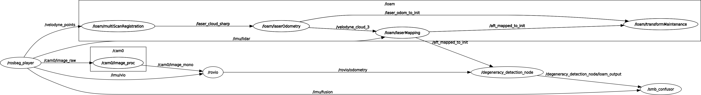

# Package vil_fusion

This package is poorly named. The actual fusion happens in the package `gtsam_fusion`.

This package was used primarily to experiment with degeneracy detection and ConFusion. The ConFusion
part never did work. The degeneracy detection experiments all relied on a different customized version
of LOAM, found [here](https://bitbucket.org/leggedrobotics/loam_velodyne/src/tim-experimental/). This
version is not included in this repository, because a different version of LOAM was used for the
final fusion setup implemented in the `gtsam_fusion` package.

To run nodes in this package, replace the version of LOAM included here with the `tim-experimental` branch
linked above. There may still be errors, as this package was not used after the `gtsam_fusion` package was created.

Known issue: I had trouble building, because I would get the error "Eigen/Core: No such file or directory".
I fixed this by running the command `sudo ln -s /usr/include/eigen3/Eigen /usr/include/Eigen`

This package is for running experiments on ROS bags. To do so:

 - `roslaunch vil_fusion vil_fusion_bag.launch bagfile:=<Path to ROS bag>`
   - `rovio:=false` to disable Rovio
   - `loam:=false` to disable Loam
   - `do_fusion=false` to disable ConFusion
   - `rviz:=true` to enable the Rviz configuration included with Loam
   - In the future, I will include an Rviz configuration that displays both Rovio and Loam odometry in a convenient way.
 - To launch Rovio with the real-life SMB data (from Tim Sandy):
   - `roslaunch vil_fusion vil_fusion_smb.launch bagfile:=<Path to ROS bag>`
   - The SMB (SuperMegaBot) data has the image flipped, so this launch file also launches
     a node to flip the image into the correct orientation.
 - There are also several other launch files configured for several other datasets. However,
   these all rely on the `loam_velodyne` fork that is no longer contained in this repo.

I have sample bags available on [Polybox](https://polybox.ethz.ch/index.php/s/RqxMMW2CLFNMDpx). Note that
these bags are out of data, and possibly contain data which is corrupted by bugs that existed in Carla at
the time the simulations were run.

## Degeneracy Detection Node

The `degeneracy_detection_node` is the core of my thesis. For each odometry message from either Rovio or Loam, it
performs some calculations to determine whether the source of the measurement is degenerate. For my thesis, I will
test many different functions to do this, so I have written this node to be configurable.

In the file `src/vil_fusion/degeneracy_detection_functions.py`, there are several functions, which all take a matrix
and a message as input, and output a `DegeneracyScore` message. For each of Rovio and Loam, you can configure a set
of these functions to be used. If any one of these functions returns a `True` value for degeneracy, then the measurement
will be discarded.

To configure which functions will be used, set the parameters `/degeneracy_detection_node/loam_degen_funcs` and
`/degeneracy_detection_node/loam_degen_funcs` to an array of strings, where each string is the name of a function
in `degeneracy_detection_functions.py`. For diagnostics, see the ROS topics `/degeneracy_detection_node/{rovio or loam}/*`.

Each of these functions needs only to set the fields `score`, `threshold`, and `degenerate` of the `DegeneracyScore`
message. The `header` and `name` are handled automatically by the node.

## Node Structure

The `vil_fusion.launch` launch file launches the following:

 - `image_proc`: The images from Carla are in color. Rovio expects monochrome. `image_proc` does this conversion.
 - `rovio`: Visual odometry. Takes in IMU and Images, outputs pose and odometry messages.
 - `loam`: Consists of several nodes, which together take in IMU and Lidar point clouds, and
    output odometry messages.
 - `degeneracy_detection_node`: This is the core of my thesis. It takes as input the odometry messages from rovio and loam.
    For each message, it checks whether the measurements are valid and whether rovio or loam have become degenerate.
    If they have, the message is discarded entirely. If not, then the message is passed on unaltered.
 - `smb_confusor`: The implementation of ConFusion used by the SuperMegaBot. It fuses IMU measurements with 
    pose measurements from multiple sources (In this case, Rovio and Loam). Note that this setup was experimental,
    and the final fusion described in my thesis is implemented in the `gtsam_fusion` package.

These are some of the most important ROS topics. Unless otherwise mentioned, all data is in the right-handed
ROS convention (X forward, Y left, Z up)

 - `/imu/lidar`: The IMU that is connected to the Lidar
 - `/imu/vio`: The IMU that is connected to the camera
 - `/imu/fusion`: A third IMU which provides independent IMU measurements to ConFusion. In the current
    simulation configuration, it is mounted in the exact same location as the camera IMU.
 - `/cam0/image_raw`: Color image from camera
 - `/cam0/image_mono`: Monochrome image produced by `image_proc`
 - `/velodyne_points`: Raw Lidar measurements
     - Despite the name, this is _not_ in the Velodyne coordinate frame (Y forward, X right, Z up). It is in the
       standard ROS frame. But for some reason, I could not remap this topic to a better name. (I could remap the
       IMU topic that LOAM uses, but not this one! Why? If you figure it out, please let me know!)
 - `/rovio/odometry`: Odometry from Rovio (Very descriptive name)
 - `/aft_mapped_to_init`: Odometry from LOAM
     - This is _not_ in the standard ROS convention. It is in LOAM's convention (X left, Y up, Z forward). However,
       the transformations and header are all done properly, so if necessary, you can probably convert it to the ROS convention
       using tf2.
 - `/degeneracy_detection_node/rovio_output`: Contains only the `/rovio/odometry` measurements which were not degenerate.
 - `/degeneracy_detection_node/loam_output`: Contains only the `/aft_mapped_to_init` measurements which were not degenerate.
 - `/degeneracy_detection_node/{rovio, loam}/*`: Diagnostic information for each degeneracy detection method
    that is currently in use.
    
Here is the output from `rqt_graph` while everything is running:

